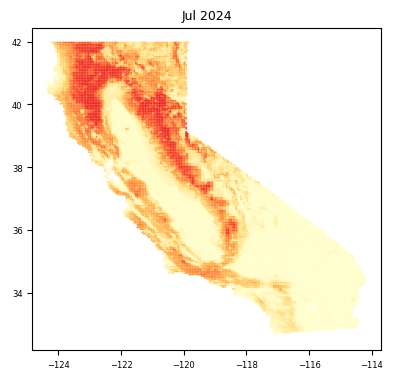
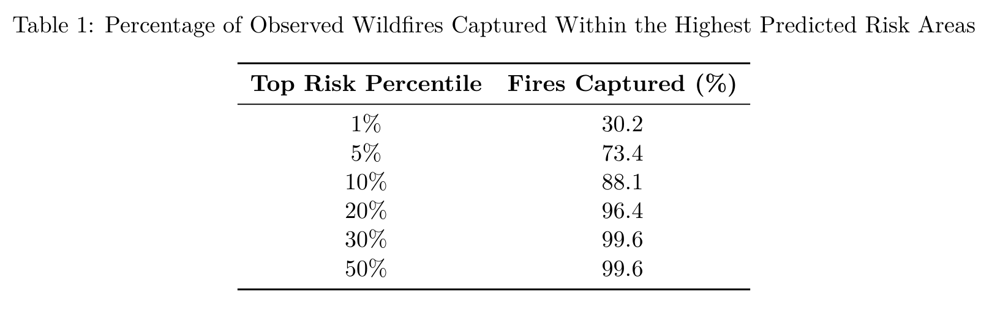
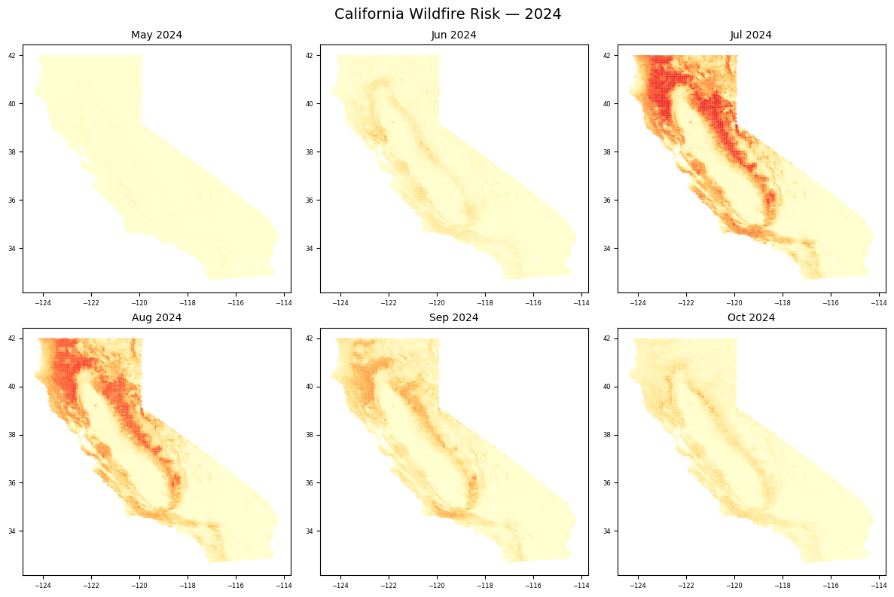
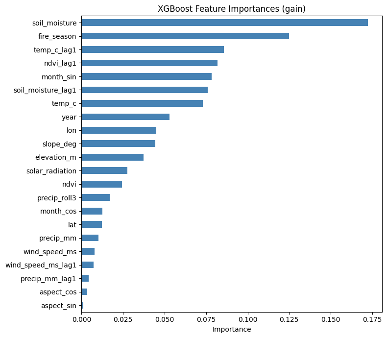
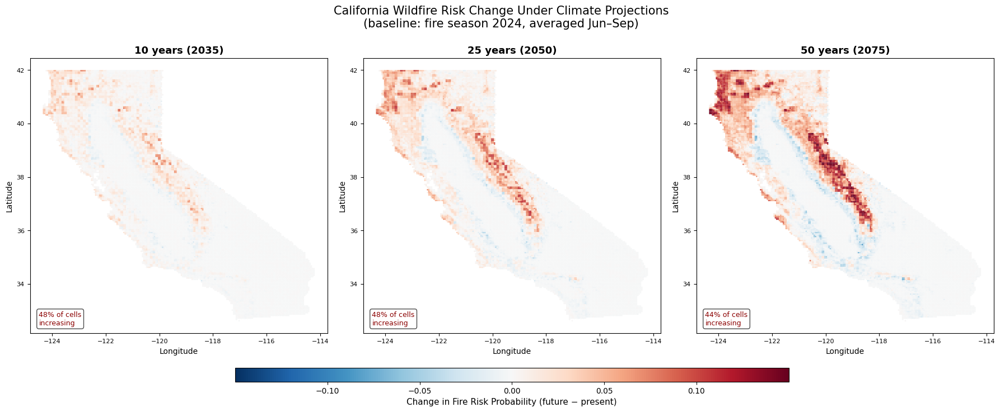

# California Wildfire Risk Prediction

> Using machine learning to predict monthly wildfire risk across California and project how that risk shifts under climate change.

**Authors:** Alessandro De Leo, Simone De Vecchis - *Stanford University, Spring 2026*

---

## Overview

This project trains an XGBoost classifier on ~13 years of spatiotemporal data to predict the probability of wildfire occurrence at each 0.05° (~5.6 km) grid cell across California, at monthly resolution. The trained model is then used without retraining to project wildfire risk changes over the next 10–50 years by applying IPCC AR6-aligned climate perturbations to the input features.

> **Note:** More files and a downloadable compiled dataset are still being added to this repo.

---

## Example Output



---

## Research Questions

- Can XGBoost classify the highest-risk wildfire areas across California at monthly resolution?
- How will the risk area and intesnity shift under projected climate change over the next 10–50 years?

---

## Data Sources & Acknowledgments

The dataset we used to train and test the model is standardized work compiled from multiple public sources. The original data has been modified, filtered, and applied for machine learning purposes.

| Source | Data | Citation |
|---|---|---|
| CAL FIRE FRAP | Historical fire perimeters | Contains data from the California Department of Forestry and Fire Protection (CAL FIRE) Fire and Resource Assessment Program (FRAP), modified by the author. |
| Copernicus ERA5 | Temperature, precipitation, wind speed, soil moisture, solar radiation | Contains modified Copernicus Climate Change Service information (ERA5 Reanalysis). |
| MODIS + Google Earth Engine | Monthly NDVI (vegetation index) | MODIS NDVI data courtesy of the NASA Land Processes Distributed Active Archive Center (LP DAAC), retrieved and processed using Google Earth Engine. |
| USGS 3DEP | Elevation, slope, aspect (30m DEM) | Map services and data available from U.S. Geological Survey, National Geospatial Program. |

### Data Pipeline

All four sources were standardized to a **0.05° spatial grid (~5.6 km cells) with monthly time steps** and saved as CSV files:

- **Fire perimeters:** CAL FIRE FRAP shapefiles were rasterized to the grid. Each cell has a binary fire indicator for the month and, if ignited, the burned area in acres.
- **Weather:** ERA5 NetCDF files were regridded to the same spatial/temporal resolution.
- **Topography:** 30m DEM tiles were scraped from the USGS 3DEP online file system and aggregated to the grid (monthly variance was assumed to be negligible so we excluded the monthly time steps).
- **NDVI:** MODIS data was aggregated via Google Earth Engine to the same grid and monthly time steps.

The result is 4 clean CSV files with ~6 million rows (grid_id × year_month), ready for ML training.

---

## Getting the Data

The compiled dataset used for training and evaluation is available in the companion repository:

**Dataset Repository:** https://github.com/Emit07/wildfire-prediction-data

Clone the dataset repository:

```bash
git clone https://github.com/Emit07/wildfire-prediction-data
```

### Directory Structure

The notebooks in this repository expect the data to be located at:

```text
wildfire_project/
├── data/
│   ├── ca_fire_monthly_2012_2025.csv
│   ├── california_monthly_weather.csv
│   ├── ndvi.csv
│   └── elevation_grid.csv
```

If you are using Google Colab, upload the dataset repository to your Google Drive. The default notebook path assumes:

```text
/content/drive/MyDrive/wildfire_project/data/
```

You are welcome to modify the file paths in the notebooks if you prefer a different directory structure or are running locally.

### Dataset Contents

The dataset contains approximately 13 years of monthly wildfire, weather, vegetation, and topographic data aggregated to a 0.05° (~5.6 km) grid across California:

| File | Description |
|--------|------------|
| `ca_fire_monthly_2012_2025.csv` | Historical fire occurrence labels and burned area information |
| `california_monthly_weather.csv` | ERA5-derived temperature, precipitation, wind speed, soil moisture, and solar radiation |
| `ndvi.csv` | Monthly vegetation index (NDVI) derived from MODIS |
| `elevation_grid.csv` | Elevation, slope, and aspect derived from USGS 3DEP data |

See the dataset repository README for additional details on preprocessing, data sources, and attribution.

---

## Model

### Why XGBoost?

XGBoost was selected after evaluating three candidate models:

| Model | Outcome |
|---|---|
| **XGBoost** | ✅ well-calibrated probabilities, handles class imbalance (able to generalize), fast with `tree_method='hist'` |
| Other Models | ❌ Too slow to train on ~6M rows, could not handle class imbalance, lower capture and roc-auc rates |

XGBoost is particularly suited for this problem because it handles structured tabular data well, supports monotone constraints, and allows detailed control over class imbalance. The control over class imbalance is critical when fires represent less than 0.02% of all cell-months.

### Train / Test Split

- **Training:** 10 years of data
- **Testing:** ~3 years of held-out data
- **Feature engineering:** Lag features added for wind, soil moisture, NDVI, and precipitation to capture antecedent conditions driving fire risk.

### Hyperparameters

```python
model = XGBClassifier(
    n_estimators          = 1000,   # large ensemble; compensates for low learning rate
    max_depth             = 3,      # shallow trees means smooth probability gradients rather than hard cutoffs
    learning_rate         = 0.02,   # low LR with many trees for stable convergence
    subsample             = 0.7,    # row subsampling means overfitting reduction
    colsample_bytree      = 0.7,    # feature subsampling per tree
    min_child_weight      = 30,     # requires 30+ samples per leaf prevents overfitting rare fire events
    gamma                 = 1.0,    # minimum loss reduction for a split prunes noisy splits
    reg_alpha             = 0.1,    # L1 regularization
    reg_lambda            = 5.0,    # L2 regularization (strong, this constrains leaf weights)
    scale_pos_weight      = spw_soft,  # sqrt(neg/pos) soft class imbalance correction
    max_delta_step        = 1,      # stabilizes updates under high class imbalance
    eval_metric           = 'logloss', # penalizes overconfident predictions and improves calibration
    early_stopping_rounds = 30,
    random_state          = 42,
    tree_method           = 'hist', # fast histogram based training
    n_jobs                = -1,
)
```

**Key tuning insight:** Early model iterations collapsed into an elevation mask, cells between 250m and 2500m were assigned near 1 fire risk regardless of season or weather. This was caused by a very high `scale_pos_weight` (full negative/positive ratio, ~50–100×) combined with deep trees. The fix was to use `spw_soft = np.sqrt(neg / pos)`, reduce `max_depth` from 6 to 3, raise `min_child_weight` to 30, and switch `eval_metric` to `logloss`. Changing these metrics produced a smooth and well calibrated probability gradient.

---

## Results

### Evaluation Metrics

```
ROC-AUC : 0.9546
PR-AUC  : 0.0038
```

The high ROC-AUC reflects that fires almost always occur in cells the model already ranks as high-risk. The low PR-AUC is expected as wildfires are an extremely rare event (~0.02% of all cell-months), and because the model flags large contiguous risk zones, many high-risk cells will never ignite in any given year. This does not mean that the model predictions are wrong, they are just unfired fuel instead. The capture rate table is a more actionable metric:




By monitoring only the top 10% of highest-risk cells, resource managers can expect to have pre-identified the location of 88% of all fires before they occur.

### Prediction Maps



Monthly risk maps (May–October) show strong seasonal dynamics: foothills and lower-elevation mountains carry the highest risk early in the season when higher elevations are still too cold to burn. By mid-summer, risk concentrates in the Sierra Nevada and Coast Ranges. The Central Valley and desert regions show near-zero risk year-round.

### Feature Importance



Soil moisture and its lag dominate. Dry antecedent conditions are the single strongest predictor of ignition risk. Temperature (especially lagged) and NDVI capture the heat/vegetation-stress interaction. The `fire_season` binary and `month_sin` encode seasonality. Topographic features (slope, elevation) shape the spatial envelope of risk but are outranked by weather.

---

## Climate Change Projections (2035 / 2050 / 2075)



Using IPCC AR6 trends for California, we projected the 2024 baseline inputs and re-ran the trained model at three future horizons without retraining. The change in predicted fire probability (future − present) is mapped per grid cell.

| Variable | Change per decade | Rationale |
|---|---|---|
| `temp_c` | +0.5 °C | IPCC AR6: ~1–2 °C warmer by 2050 for CA |
| `precip_mm` | −3% | CA regional models: drier summers |
| `soil_moisture` | −2% | Follows reduced precip + increased evaporation |
| `ndvi` | −1% | Vegetation stress under heat/drought |

Lag features are shifted by the same amounts for consistency. By 2075, ~46% of California grid cells show meaningfully increasing fire risk, concentrated in mid and high elevation mountain zones. Some low elevation areas show modest decreases as conditions become too arid to sustain fire carrying vegetation.

These projections can directly inform long term land management, prescribed burn planning, and infrastructure prioritization in high risk corridors.

---

## Repository Structure 
├── data_exploration.ipynb          # EDA, data distributions, fire seasonality \
├── wildfire_risk_xgboost.ipynb     # Model training, tuning, evaluation \
├── wildfire_risk_future_change.ipynb  # Climate change projection maps \
├── media/                          # Output figures and maps \
└── README.md

```text
wildfire-prediction/
├── data/
│   ├── ca_fire_monthly_2012_2025.csv
│   ├── california_monthly_weather.csv
│   ├── ndvi.csv
│   └── elevation_grid.csv
├── media/
│   └── ...
├── model/
│   ├── wildfire_xgb.joblib
│   └── feature_list.json
├── data_processing/
│   ├── convert_elevation.py
│   ├── convert_era5.py
│   ├── convert_frap.py
│   └── convert_ndvi.py
├── README.md
├── data_exploration.ipynb
├── wildfire_risk_model.ipynb
└── wildfire_risk_projections.ipynb
```


---

## Roadmap

- [ ] Add download link for compiled CSV datasets
- [ ] Add automated data download and validation scripts
- [ ] Package notebooks into a reproducible pipeline for local execution

---

## License & Data Attribution

Please cite the original data providers if you use this work:

- **CAL FIRE FRAP:** Contains data from the California Department of Forestry and Fire Protection (CAL FIRE) Fire and Resource Assessment Program (FRAP), modified by the author.
- **Copernicus ERA5:** Contains modified Copernicus Climate Change Service information (ERA5 Reanalysis).
- **MODIS/GEE:** MODIS NDVI data courtesy of the NASA Land Processes Distributed Active Archive Center (LP DAAC), retrieved and processed using Google Earth Engine.
- **USGS 3DEP:** Map services and data available from U.S. Geological Survey, National Geospatial Program.
